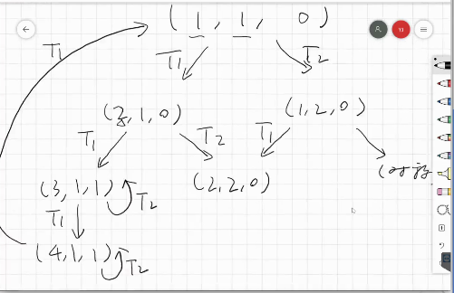
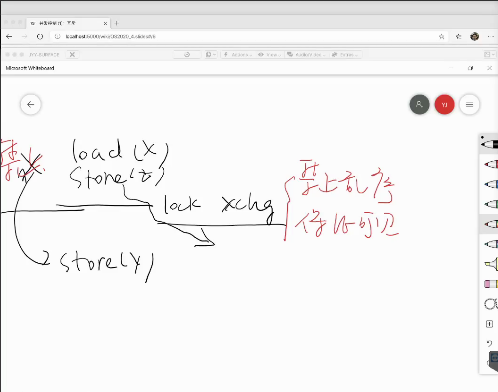

## 互斥问题

+ 实现lock_t数据结构和lock/unlock API。

+ 一把排他性的互斥锁同时只有可能有一个进程进入该所的locked状态。

### 互斥锁能够用来阻止并发的发生，实现“串行化”

+ lock/unlock保护的区域称为一个原子的黑盒子
+ 黑盒子代码必定存在一定的顺序
+ 先完成的黑盒子的内存访问在之后的黑盒子中可见

## 共享内存上的互斥

+ 支持的基本操作
  + 线程本地计算（对其他线程不可见）
  + load
  + store
  + 其中load和store对内存和其他线程可能带来影响。

+ Peterson在现实应用中存在的问题
  + 操作本身也会变成指令，可能乱序，从而无法实现逻辑

+ 更多现代的计算机机制会让互斥的实现更加困难
+ 总结而言共享内存上的互斥
  + “状态机每一步选择一个线程执行一条指令”是错误的假设
  + 不经意的编译器/处理器乱序
  + 看起来“原子”（不可分割）的一条指令并不原子。

## 从硬件上实现互斥

+ 使用状态机来分析问题

  

  其中数字代表第几行语句。

+ 根据上述状态机考虑原子指令的帮助。使用原子型的xchg算法能够实现互斥。这样得到OS课的第一个锁算法：自旋锁。

  ```c
  int locked = 0;
  void lock()   {
    while (xchg(&locked, 1)) ;
  }
  
  void unlock() {
    xchg(&locked, 0);
  }
  ```

  原子指令会阻止CPU对前后指令乱序执行：

  

+ Load-Reserved/Store-Conditional(LR/SC)

  进行一次load之后为变量打上标记，在store时检查是否存在自己的标记，如果不存在标记则出错并进行处理，如果存在标记则成功store。

  

