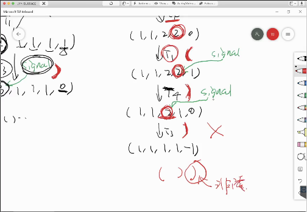

## 并发控制：同步

### 同步

+ 两个或两个以上随时间变化的量在变化过程中保持一定的相对关系。

+ 一个同步的例子是join

  ```c
  int done;
  
  void workload() {
    // workload
    asm volatile("lock addq $1, %0" :
                 "=m"(done)); // sync(): 顺序、原子、可见
  }
  
  int main() {
    for (int i = 0; i < nworkers; i++) 
      create(workload);
    while (done != nworkers); // sync(): 等到所有 workers 都完成
    printf("All done\n");
  }
  ```

  + 上述代码是错误的，原因是编译器可能会进行相应的编译优化，那么事实上，`while(done!=nworkers)`被编译为几条汇编代码，这几条汇编代码中会先将`done`地址对应存储的值赋值给EAX寄存器，之后的几条汇编都是将EAX与`nworkers`（比如常数4）进行比较。故如果４个线程在赋值给EAX寄存器的汇编代码执行之前完成，会得到正确的结果，否则会陷入死循环。
  + 解决方法之一是使用`volatile int done;`声明，这样编译`while(done!=nworkers)`语句时，每一次循环都会重新取出done地址处存储的值，即不会进行编译优化。

### 生产者－消费者问题

+ 并发控制中的最经典问题，能解决90%的实际并发问题。
+ 生产者－消费者问题可以通过一个使用自旋锁保护的队列实现。
+ 另一个简单的表达是左括号与右括号的匹配，左括号代表入列，右括号代表出列，则生产者－消费者问题能够对应一个合法的括号序列打印，并且括号的最大嵌套深度代表了队列的缓冲区。

### 条件变量

+ 使用条件变量解决生产者－消费者问题

  ```c
  void producer_thread() {
    while (1) {
      // produce
      mutex_lock(&mutex);
      if (count == n) wait(&cv, &mutex); // 等待“有空闲”
      printf("("); // push
      count++; signal(&cv);
      mutex_unlock(&mutex);
    }
  }
  
  void consumer_thread() {
    while (1) {
      mutex_lock(&mutex);
      if (count == 0) wait(&cv, &mutex); // 等待“有数据”
      printf(")"); // pop
      count--; signal(&cv);
      mutex_unlock(&mutex);
      // consume
    }
  }
  ```

  mutex 大幅简化了正确性的证明

  

  

  第二张截图中是代码错误的情况，原因是若有两个消费者进程等待，当一个进程被signal唤醒时，它也会立刻唤醒另一个等待的消费者进程；即有可能会导致`())`的情况。

+ 对上述问题的分析和解决：

  + 事实上，消费者和生成者的条件是不同的，因此可以使用两个条件变量，例如empty和fill两个条件变量来解决问题；
  + 此外，使用while也可以解决上述问题。

+ 使用while在wait之后进行循环判断的方式是一种通用的同步算法，通用代码样例如下

  ```c
  mutex_lock(&big_lock);
  while (!(cond)) {
    wait(&cv, &big_lock);
  }
  assert(cond); // 一定为真
  // 其他需要原子性的操作
  mutex_unlock(&big_lock);
  ```

### 信号量

+ 从“资源”的角度考虑信号量，通过P\V过程来处理并发问题；某种思考角度是可将信号量看作是互斥锁和条件变量的结合体。

+ 通过信号量实现生成者-消费者

  ```c
  void producer() {
    P(&empty);   // P()返回 -> 得到手环
    printf("("); // 假设线程安全
    V(&fill);
  }
  
  void consumer() {
    P(&fill);
    printf(")");
    V(&empty);
  }
  ```

+ to be implemented

### 哲学家吃饭问题

+ 使用条件变量

  ```c
  #define cond (empty[lhs] && empty[rhs])
  
  void philosopher(int id) {
    int lhs = (id - 1 + n) % n, rhs = (id + 1) % n;
    mutex_lock(&mutex);
    while (!cond) {
      wait(&cv, &mutex);
    }
    assert(cond);
    empty[lhs] = empty[rhs] = 0;
    mutex_unlock(&mutex);
  
    __philosopher_eat();
  
    mutex_lock(&mutex);
    emtpy[lhs] = empty[rhs] = 1;
    broadcast(&cv); // 对所有人喊：叉子放回去啦，快看看吧！
    mutex_unlock(&mutex);
  }
  ```

+ 可以令一个哲学界为waiter，则通过waiter管理所有哲学家的吃饭问题；此外也可以设置不止一个waiter，通过不同waiter之间的协同完成任务；可能的问题是效率问题，但考虑效率问题首先需要考虑workload，对于特定的任务情景而言，这种方法是可行的。

  ```c
  void philosopher(int id) {
    send_request(id, EAT);
    P(allowed[id]); // 直到manager允许我吃了才开始
  
    __philosopher_eat();
  
    send_request(id, DONE);
  }
  
  void manager() {
    while (1) {
      (id, status) = receive_request();
      if (status == EAT) { ... }
      if (status == DONE) { ... }
    }
  }
  ```

